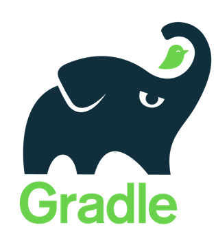
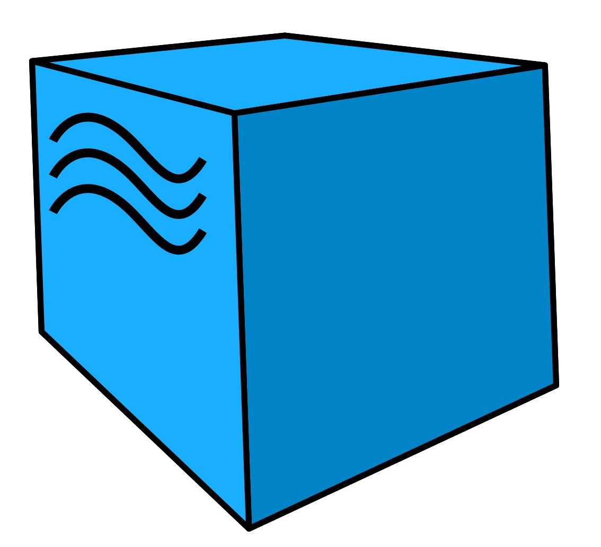

# Проект автоматизации тестирования для компании  [DPD](https://dpd.ru/)
## Содержание:

- [Технологии и инструменты](#технологии-и-инструменты)
- [Примеры автотестов](#примеры-автотестов)
- [Локальный запуск тестов в Idea](#локальный-запуск-тестов-в-Idea)
- [Сборка в Jenkins](#сборка-в-jenkins)
- [Allure Report](#allure-report)
- [Уведомления о результатах тестов в Telegram](#уведомления-о-результатах-тестов-в-telegram)
- [Видео примера запуска тестов Selenoid](#ввидео-примера-запуска-тестов-selenoid)

## Технологии и инструменты

<p align="center">   
<a href="https://www.java.com/"></a>
<a href="https://www.jetbrains.com/idea/"></a>
<a href="https://github.com/"></a>   
<a href="https://gradle.org/"></a>
<a href="https://junit.org/junit5/"></a>
<a href="https://selenide.org/"></a>  
<a href="https://aerokube.com/selenoid/"></a>  
<a href="https://github.com/allure-framework/allure2"></a>  
<a href="https://www.jenkins.io/"></a>
</p>

В проекте автотесты написаны на языке <code>Java</code> с использованием фреймворка для тестирования <code>Selenide</code>.
- В качестве сборщика был использован - <code>Gradle</code>.
- Использованы фреймворки <code>JUnit 5</code> и <code>Selenide</code>.
- Прогон автотестов запускается на удалённом сервере <code>Selenoid</code>.
- Запуск реализован через <code>Jenkins</code> с формированием Allure-отчета и отправкой результатов в <code>Telegram</code> при помощи бота.

## Примеры автотестов
-  Тест для проверки строки поиска на сайте
-  Тест поиска информации по посылке по трек-номеру
-  Проверка основных элементов на главной странице
-  Проверка кликабельности кнопки В другую страну
-  Проверка наличия рекламного банера на странице


##  Локальный запуск тестов в Idea
```
gradle clean dpd_test
```

<a id="jenkins-build"></a>
## Сборка в Jenkins

[Сборка в Jenkins](https://jenkins.autotests.cloud/job/038-kostyukova_ea-Jenkins12/)


## Allure Report

## Уведомления о результатах тестов в Telegram

## Видео примера запуска тестов Selenoid
